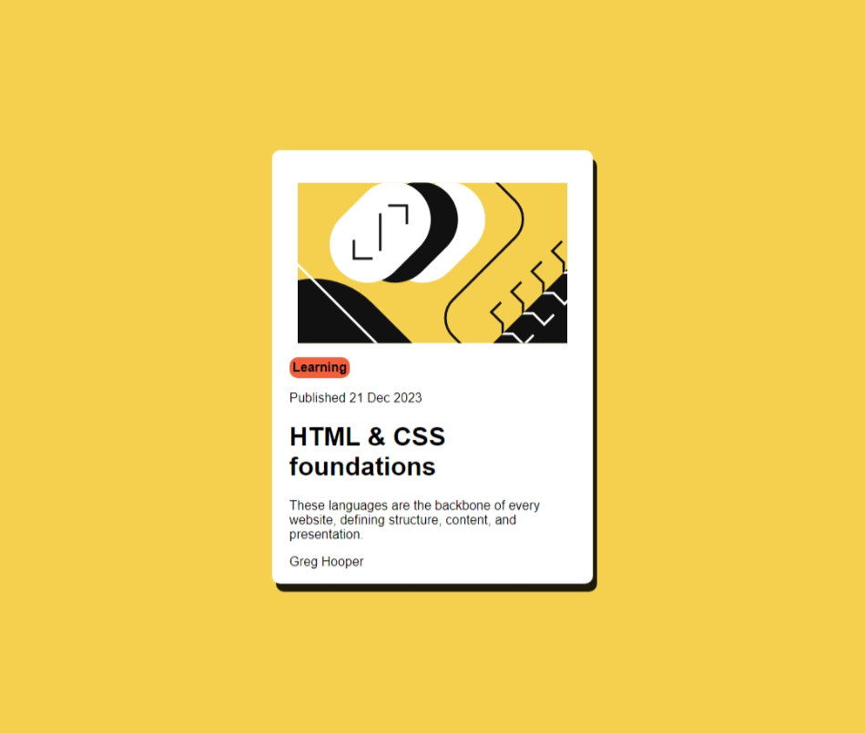

# Frontend Mentor - Blog preview card solution

This is a solution to the [Blog preview card challenge on Frontend Mentor](https://www.frontendmentor.io/challenges/blog-preview-card-ckPaj01IcS). Frontend Mentor challenges help you improve your coding skills by building realistic projects. 

## Table of contents

- [Overview](#overview)
  - [The challenge](#the-challenge)
  - [Screenshot](#screenshot)
  - [Links](#links)
- [My process](#my-process)
  - [Built with](#built-with)
  - [What I learned](#what-i-learned)
  - [Continued development](#continued-development)
  - [Useful resources](#useful-resources)
- [Author](#author)
- [Acknowledgments](#acknowledgments)

**Note: Delete this note and update the table of contents based on what sections you keep.**

## Overview

### The challenge

Users should be able to:

- See hover and focus states for all interactive elements on the page

### Screenshot

]

### Links

- Solution URL: [Add solution URL here](https://your-solution-url.com)
- Live Site URL: [Add live site URL here](https://your-live-site-url.com)

## My process

### Built with

- Semantic HTML5 markup
- CSS custom properties
- CSS Grid

### What I learned

With is project, I have learned more about CSS margin, padding and how they affect the design and implementation of the website.
I have also learned how to do indentation and add background color for the text.
Also, I have learned how to add the shadow.
Hover.

### Continued development

Make it as similar to the example given by frontend mentor.
Make it responve with mobile web layout.
### Useful resources

- [resource 1](https://www.w3schools.com/cssref/css3_pr_box-shadow.php) - This help me to understand how box shadow works.
- [resource 2](https://stackoverflow.com/questions/11455865/getting-background-to-be-same-width-as-text-but-different-height) - A answer for adding color under text but make the background a bit larger than the text.

## Author

- Frontend Mentor - [@amersfoort3232](https://www.frontendmentor.io/profile/amersfoort3232)
- LinkedIn - [amersfoort-lam](https://www.linkedin.com/in/amersfoort-lam/)
